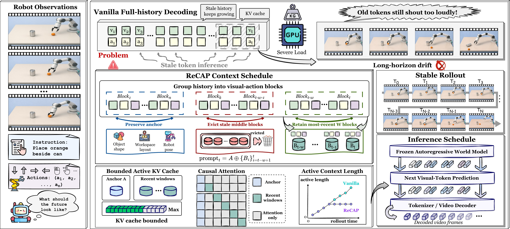
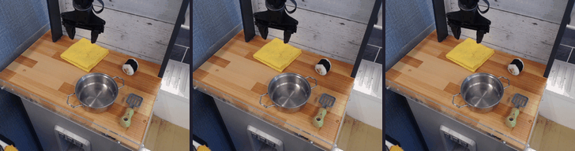
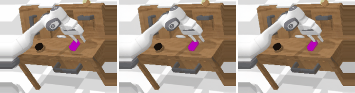
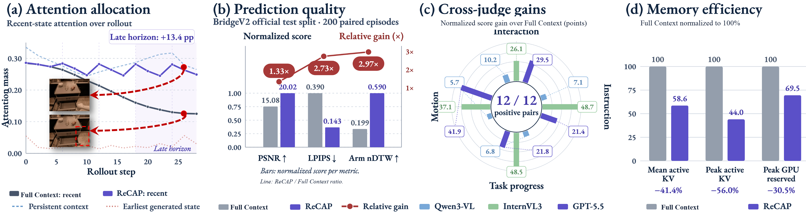

<div align="center">

# ReCAP

### Remembering What Matters for Long-Horizon Robot World Models

**Preserve the anchor. Keep recent dynamics. Evict stale history.**

[Paper](https://anonymous.4open.science/r/ReCAP-003B/site/paper.pdf) · [Project page](https://anonymous.4open.science/w/ReCAP-003B/) · [Quick start](#quick-start) · [Documentation](#documentation)

[Apache-2.0 license](LICENSE) · Anonymous review snapshot

</div>



**ReCAP** (*Receding Context with Anchor Preservation*) schedules the context of a frozen autoregressive world model. It reuses generated tokens directly: **no additional training, no extra weights, no pixel re-encoding**.

| Preserve | Retain | Evict |
| :---: | :---: | :---: |
| Initial scene + dynamic anchor | Latest **W** complete visual–action blocks | Stale middle history |

With **W = 6**, the released model's prompt stays within **1,931 tokens**. This repository provides code for the **~127M robot reference models** for RT-1, CALVIN, LIBERO-90 and BridgeV2; see [release coverage](docs/COVERAGE.md) for the paper experiments covered.

## Quick start

Run a **Full Context vs. ReCAP** comparison on one CALVIN episode. Requires Linux, an NVIDIA GPU and Python 3.10+; use a fresh [CUDA environment](docs/ENVIRONMENT.md). ReCAP inference needs no training.

### 1 · Install

```bash
# Extract the anonymous code archive and enter its directory.
cd ReCAP
python -m venv .venv
source .venv/bin/activate
python -m pip install -e '.[inference,metrics,assets,vllm]'
```

### 2 · Prepare weights and one episode

```bash
# Place matched assets under weights/ (see weights_manifest.json).
recap verify --help
```

**Checkpoint access:** this anonymous snapshot includes source code, configurations, evaluation scripts, and qualitative examples. Model weights and datasets are separate dependencies and are not bundled here. Place the matched tokenizer, world model, and action ranges at the paths in `weights_manifest.json`; the run command below checks their SHA-256 hashes. Author-identifying download locations are omitted during review. Follow the [CALVIN preparation recipe](docs/REPRODUCE.md#prepare-calvin-data) to create `data/calvin_example/episode.npz` (**66+ frames** with aligned actions).

### 3 · Run

```bash
recap run --config configs/calvin_h64.json \
  --assets ./weights --data ./data/calvin_example \
  --output ./runs/calvin_demo --verify-manifest weights_manifest.json
```

Open **`runs/calvin_demo/compare_all_strategies.gif`** to view the comparison. Predictions and run metadata are saved beside it. [Other datasets, outputs and troubleshooting →](docs/REPRODUCE.md)

## See the rollouts

**Left → right: ground truth · Full Context · ReCAP.** Selected illustrations; [case identities and selection](docs/CASES.md).

**BridgeV2 · 32 predicted frames**



**CALVIN · 64 predicted frames**



[More rollouts on the project page →](https://anonymous.4open.science/w/ReCAP-003B/site/index.html#rollouts) · For all **12 released cases**, open [`gallery.html`](gallery.html) locally.

## Paper at a glance



*Original paper figure; panels use dedicated samples and horizons. The released reference experiments cover a subset of the manuscript. See [figure provenance](docs/assets/README.md) and [archived results](docs/COVERAGE.md#archived-results) before comparing numbers.*

## Documentation

| I want to… | Start here |
| :--- | :--- |
| Reproduce a rollout or switch datasets | [Reproduction guide](docs/REPRODUCE.md) |
| Download data or check preprocessing | [Data sources & format](docs/DATA.md) |
| Plug ReCAP into my own decoder | [Scheduler API](docs/SCHEDULER.md) |
| Run evaluations or inspect training code | [Experiments](docs/EXPERIMENTS.md) |
| Check released models and verification | [Model cards](model_cards/README.md) · [Coverage](docs/COVERAGE.md) · [Validation](docs/VALIDATION.md) |

## Citation & license

Please cite the [paper](https://anonymous.4open.science/r/ReCAP-003B/site/paper.pdf) and use [CITATION.cff](CITATION.cff) for this software release. Archival paper citation metadata will be added when available.

New ReCAP code: [Apache-2.0](LICENSE). Upstream components retain their original licenses; see [NOTICE](NOTICE) and [third-party attribution](THIRD_PARTY_NOTICES.md). Dataset and model terms remain separate.
